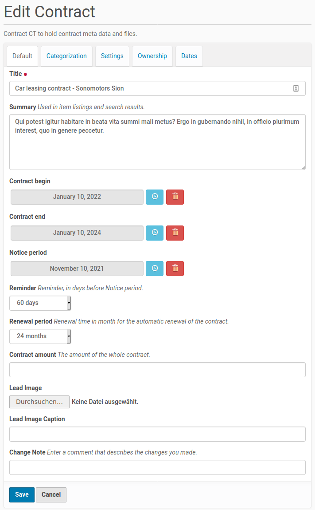

.. This README is meant for consumption by humans and pypi. Pypi can render rst files so please do not use Sphinx features.
   If you want to learn more about writing documentation, please check out: http://docs.plone.org/about/documentation_styleguide.html
   This text does not appear on pypi or github. It is a comment.

.. image:: https://travis-ci.org/collective/collective.contract_management.svg?branch=master
    :target: https://travis-ci.org/collective/collective.contract_management

.. image:: https://coveralls.io/repos/github/collective/collective.contract_management/badge.svg?branch=master
    :target: https://coveralls.io/github/collective/collective.contract_management?branch=master
    :alt: Coveralls

.. image:: https://img.shields.io/pypi/v/collective.contract_management.svg
    :target: https://pypi.python.org/pypi/collective.contract_management/
    :alt: Latest Version

.. image:: https://img.shields.io/pypi/status/collective.contract_management.svg
    :target: https://pypi.python.org/pypi/collective.contract_management
    :alt: Egg Status

.. image:: https://img.shields.io/pypi/pyversions/collective.contract_management.svg?style=plastic   :alt: Supported - Python Versions

.. image:: https://img.shields.io/pypi/l/collective.contract_management.svg
    :target: https://pypi.python.org/pypi/collective.contract_management/
    :alt: License

==============================
collective.contract_management
==============================

Provides Contracts container and Contract item CT's, to manage contracts and there lifespan. It helps you to keep track of the notice period and start on time with the negotiation, planing or canceling for each contract.

Features
--------

- Overview of all contracts or contracts which are due to verify, based on Collections
- iCal export of a notice period event, including a defined reminder via @@ics_view
- iCal export of multiple contract notice periods via collection and @@contracts_ics_view
- works well in combination with `collective.collectionfilter <https://pypi.org/project/collective.collectionfilter/>`_

Exported events are set as full day events for the contract end date, including an alarm based on notice_period and reminder value. The event summery is prefixed with the title of the most upper parent Contracts obj.

   Contract edit form

   Contracts listing based on a Collection with a contracts_view

   Filtering contracts with collective.collectionfilter

Translations
------------

This product has been translated into

- English (MrTango)
- German (MrTango)

Installation
------------

Install collective.contract_management by adding it to your buildout::

    [buildout]

    ...

    eggs =
        collective.contract_management[collectionfilter]

and then running ``bin/buildout``

Contribute
----------

- Issue Tracker: https://github.com/collective/collective.contract_management/issues
- Source Code: https://github.com/collective/collective.contract_management

Support
-------

If you are having issues, please let us know.
If you have questions or need adjustments, contact md@derico.de.

License
-------

The project is licensed under the GPLv2.
